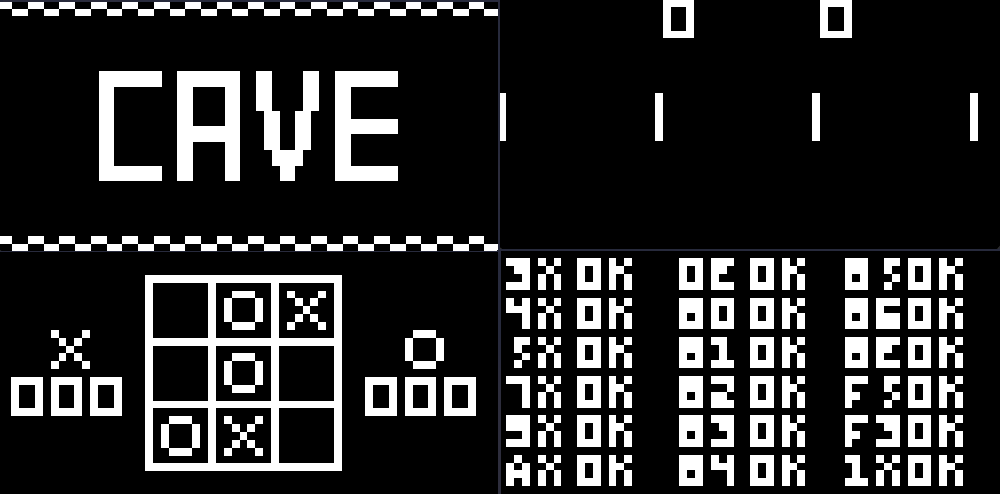

# fries

A bare-bones CHIP-8 emulator in Rust—no bullshit. Drop a `.ch8` ROM into `rom/`, then:

```sh
# build
cargo build

# run (e.g., scale 10×, 2ms delay)
cargo run 10 2 rom/Soccer.ch8
```

Controls map to your keyboard:

* 1 2 3 4 → CHIP-8 keys 1 2 3 C
* Q W E R → 4 5 6 D
* A S D F → 7 8 9 E
* Z X C V → A 0 B F

That's it—play some old-school games and shut off the debugger if you don’t want spammy logs. Enjoy.
